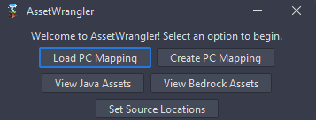
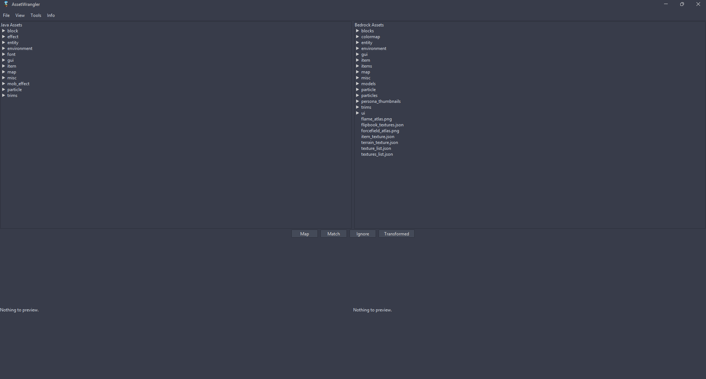
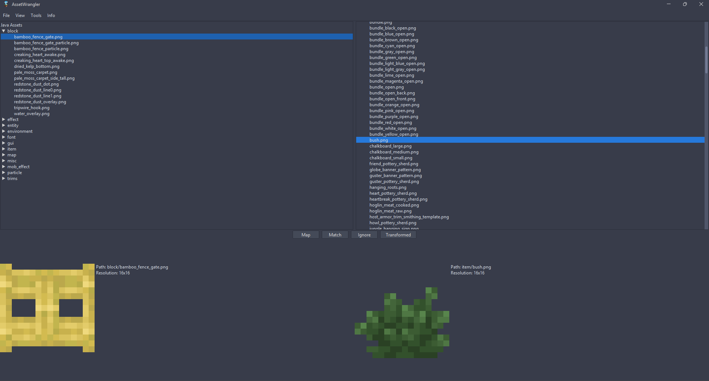

# AssetWrangler

AssetWrangler is a GUI application to help assist the development of [PackConverter](https://github.com/GeyserMC/PackCoverter/)'s mapping files.

## Features
- Mapping editor and creater
- Asset viewer (Both java and bedrock)
- Custom sources for the java/bedrock assets

## Compiling
1. Clone the repo to your computer (`git clone https://github.com/GeyserMC/AssetWrangler`)
2. Run `gradlew build` and locate to bootstrap/build folder and run the `AssetWrangler.jar` file.